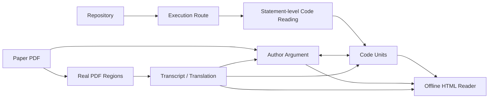

# paper-code-mapper

**Paper Code Evidence Reader — 代码优先的科研论文 × GitHub 仓库证据阅读器**

`paper-code-mapper` 是一个面向科研论文复现、代码精读和论文—代码对应分析的 ChatGPT Skill。

它不是从论文目录出发去“找几段对应代码”，而是先沿着真实代码执行路径阅读仓库，再把代码实现与论文作者的完整论证主线、公式、实验和原文证据双向连接起来。

> 核心目标：**真正读懂代码在执行什么，同时知道论文为什么这样设计、实验支持了什么，以及哪些结论其实没有被代码或实验直接证明。**

## 核心能力

### 1. Code-first：从真实执行路径读代码

默认从实验入口或用户指定函数开始，沿实际路径分析：

```text
launcher / CLI
    ↓
configuration
    ↓
entrypoint
    ↓
function / class
    ↓
tensor / state transformation
    ↓
model intervention
    ↓
evaluation
```

对每个重要语句或紧密耦合的多行表达式解释：

- Source：真实源码与已核对行号
- Meaning：语法、变量和操作到底是什么意思
- Why here：这一步在当前计算流程中的作用
- Result：执行后得到什么值、shape、状态或控制流变化
- Caller / consumer：谁调用它，结果下一步交给谁

特别适合解释：

- `self`、类与对象状态
- `if / else`、循环、函数调用和返回值
- Python slicing 与半开区间
- tokenizer / chat template
- tensor shape、transpose、reshape、broadcast
- causal shift、logits / labels 对齐
- loss reduction、mask、detach、gradient destination
- activation / hidden states 提取
- hook、steering、model editing 等内部干预
- 配置默认值、CLI 覆盖和 runtime override

## 2. Author-argument：保留作者完整论证主线

代码执行顺序和论文论证顺序是两条不同的主线，本 Skill 不会把它们混成一个目录。

论文侧会恢复类似下面的作者逻辑：

```text
Problem / Observation
        ↓
Diagnosis / Hypothesis
        ↓
Method Design
        ↓
Experiments / Ablations
        ↓
Supported Conclusion
        ↓
Limitations / Missing Evidence
```

每个论证节点都会记录：

- 它在回答什么问题
- 作者实际声称了什么
- 为什么会引出下一步设计
- 哪个公式、段落、图表或实验提供证据
- 该证据能够支持什么
- 该证据不能证明什么
- 对应哪些代码块

因此不会因为“实验效果变好”就自动声称“作者提出的机制被证明了”。

## 3. Paper Evidence：真实 PDF 原文证据

对于论文支持的代码点，阅读器可以展示：

- 原始 PDF 像素截图
- 真实 PDF 页码与区域坐标
- 原文 transcription
- 忠实区域翻译
- 作者论证解释
- 代码实现解释

这四层信息保持独立：

```text
Original PDF pixels
      ≠ Translation
      ≠ Author-argument interpretation
      ≠ Code explanation
```

不会使用重新排版的“伪截图”替代论文原图，也不会把分析文字伪装成原文翻译。

## 4. 明确区分论文与代码的一致性

论文—代码关系使用以下状态，而不是简单写“对应”：

| Status | 含义 |
| --- | --- |
| Exact match | 论文描述与当前代码路径直接一致 |
| Equivalent implementation | 数学上等价，但代码采用了不同存储/计算形式 |
| Partial match | 只实现了论文描述的一部分 |
| Runtime override | 运行时值覆盖了默认配置 |
| Implementation extension | 代码包含论文未明确描述的额外逻辑 |
| Potential mismatch | 论文与代码存在潜在冲突 |
| No direct paper counterpart | 工程代码，没有直接论文对应 |
| Unresolved | 当前证据不足，不能下结论 |

## 5. 双语言离线阅读器

项目级解析默认生成一个自包含的离线 HTML Reader。

默认准备：

- **Reading language**：简体中文 / English
- **Source / translation language**：中文翻译 / English source transcript

两个选择器彼此独立。

切换 Reading language 时，不只是按钮变化，以下内容也会一起切换：

- 代码解释
- 变量说明
- before / after 状态
- 示例
- paper commentary
- 完整 author argument

源码、公式、数值、ID 和原始 PDF 像素保持不变。

---

## 工作流



---

## 典型输入

Skill 可以接受：

- GitHub repository URL
- 本地源码目录或源码压缩包
- PDF 论文
- 用户指定的函数、类、实验或代码问题
- 已生成的 reader，需要继续补充或修正

### 示例 Prompt：AlphaSteer

```text
Use the attached AlphaSteer paper and
https://github.com/AlphaLab-USTC/AlphaSteer

Walk me through the official Llama-3.1-8B-Instruct path starting from the
experiment launcher. Explain how prompts become last-token activations, how the
benign null-space projection and malicious regression construct the steering
transformation, and how it changes hidden states during inference.

Explain the actual code statement by statement for a beginner, trace effective
configuration values, map the implementation to the paper equations and experiments,
flag mismatches or runtime overrides, and build an offline Chinese/English reader
with real PDF screenshots and faithful translations. Do not claim the paper
experiment was reproduced unless it was actually executed.
```

---

## 输出形式

### 窄问题

例如：

```text
这个函数到底提取的是 sentence 最后一个 token，还是 template 的最后一个 token？
```

默认直接在对话中给出聚焦的代码解释，包括：

1. 函数输入
2. 真实代码块
3. 逐语句解释
4. shape / state 变化
5. caller 与 next consumer
6. paper correspondence
7. 不确定性与边界

### 项目级解析

默认输出自包含 HTML Reader，包含：

- 文件 / 函数导航
- execution-order route
- statement-level annotation
- variables / examples / before-after state
- author-argument 独立视图
- code ↔ argument 双向链接
- paper screenshot viewer
- crop / full-page context
- translation index
- language selector
- search / anchors / responsive layout

---

## Repository Structure

```text
paper-code-mapper/
├── SKILL.md
├── README.md
├── agents/
│   └── openai.yaml
├── scripts/
│   ├── build_reader.py
│   ├── export_translations.py
│   ├── language_support.py
│   ├── list_locale_fields.py
│   ├── merge_sources.py
│   ├── render_sources.py
│   └── source_support.py
├── references/
│   ├── acceptance-checklist.md
│   ├── annotation-guide.md
│   ├── argument-guide.md
│   ├── evidence-policy.md
│   ├── html-contract.md
│   ├── inspection-checklist.md
│   ├── language-selection.md
│   ├── output-template.md
│   ├── screenshots-and-translation.md
│   └── source-layer-schema.md
├── assets/
│   ├── reader-template.html
│   ├── *.css / *.js / *.json
│   └── examples/
└── tests/
    ├── test_reader.py
    ├── test_argument.py
    ├── test_sources.py
    ├── test_languages.py
    └── browser_*.py
```

---

## 作为 ChatGPT Skill 使用

确保 Skill 根目录至少包含：

```text
SKILL.md
agents/openai.yaml
```

完整目录可以直接作为一个 Skill bundle 使用。`SKILL.md` 中的 `name` 为：

```text
paper-code-mapper
```

UI display name 为：

```text
Paper Code Evidence Reader
```

当前 metadata 支持：

- ChatGPT
- Codex
- API
- Atlas

---

## Reader 构建

Reader 的分析内容需要先由模型基于真实论文和源码完成。脚本只负责渲染、合并和验证，不会自动“理解论文”。

### 1. 渲染真实 PDF 区域

```bash
python scripts/render_sources.py \
  --pdf paper.pdf \
  --regions regions.json \
  --output-dir source_images
```

PDF 图像渲染需要：

- PyMuPDF
- Pillow

### 2. 合并源码分析、截图与翻译

```bash
python scripts/merge_sources.py \
  --analysis analysis.json \
  --sources source_images/source_layer.json \
  --translations translations.json \
  --output analysis_bilingual.json
```

### 3. 构建离线 HTML Reader

```bash
python scripts/build_reader.py \
  --input analysis_bilingual.json \
  --output reader.html \
  --source-pdf paper.pdf \
  --report validation.json
```

如果本地存在已核对源码树，可以额外做 verbatim source-range 检查：

```bash
python scripts/build_reader.py \
  --input analysis_bilingual.json \
  --repo-root /path/to/repository \
  --output reader.html \
  --source-pdf paper.pdf \
  --report validation.json
```

### 4. 导出论文区域文本

```bash
python scripts/export_translations.py \
  --input analysis_bilingual.json \
  --language zh-CN \
  --output selected_regions_zh.md
```

---

## 多语言机制

新 Reader 使用 schema `1.2` 和 localization extension。

语言分成两个维度：

### Reading language

控制：

- UI
- code explanation
- variables
- examples
- paper commentary
- author argument

### Source / translation language

控制选中论文截图下面显示的：

- translation
- original-language transcription

额外语言不是浏览器实时机器翻译。必须提前生成并写入 reader，离线 HTML 才会显示该语言。

---

## Validation & Tests

运行单元测试：

```bash
python -m unittest discover -s tests -v
```

可选浏览器检查需要 Playwright 和可用 Chromium：

```bash
python tests/browser_check.py --output-dir browser_checks
python tests/browser_languages.py --html reader.html --output-dir browser_language_checks
python tests/browser_sources.py --html reader.html --output-dir browser_source_checks
```

注意：

- schema validation 只能验证结构
- source-range validation 只能验证代码摘录是否与本地源码一致
- PDF hash 只能验证论文文件版本
- browser smoke test 只能验证 UI

它们都不能自动证明：

- 翻译语义完全正确
- paper-code 对应关系一定正确
- 作者提出的因果机制成立
- 论文实验已经复现

---

## 设计原则

### Code execution order ≠ Paper argument order

两条路线必须独立保留，再建立双向链接。

### Function definition ≠ Function execution

看到函数定义不代表它已经运行。

### Call edge ≠ Argument edge

A 调用 B，不代表论文逻辑上 A 是 B 的研究动机。

### Correct implementation ≠ Reproduced result

代码看起来实现了论文方法，不代表论文表格结果已经复现。

### Better metric ≠ Proven mechanism

实验变好，不自动证明作者给出的机制解释成立。

---

## 默认证据边界

本 Skill 默认优先进行**静态源码检查**，不会为了生成 Reader 而自动：

- 安装科研仓库依赖
- 下载大型 checkpoint
- 启动 GPU 实验
- 运行未知 repository launcher
- 声称复现论文结果

如果只执行了一个小型 synthetic calculation，也只会声明该计算被验证，而不会把它描述为论文复现。

---

## 适合的使用场景

- 论文 + GitHub 仓库精读
- 复现论文前的代码审计
- AI / LLM / CV / NLP 方法代码学习
- activation steering / model editing / jailbreak defense 分析
- loss、token、hidden state、attention 等底层计算追踪
- 检查 paper implementation 与 released code 是否一致
- 给零基础或跨方向研究者制作交互式科研代码阅读材料

---

## 不适合把它当作

- 自动跑通所有论文的 reproduction framework
- 只生成论文摘要的工具
- 仅根据函数名猜论文公式的 mapper
- 不检查源码就生成调用图的工具
- 自动证明论文机制正确性的系统

---

## GitHub 发布建议

如果你准备公开发布这个仓库，建议在 GitHub 页面中保留以下文件：

- `README.md`：项目介绍与使用方式
- `SKILL.md`：Skill 的核心执行规范
- `agents/openai.yaml`：ChatGPT UI metadata
- `scripts/`：Reader 构建与验证脚本
- `references/`：证据、标注、论证与语言规范
- `assets/`：Reader 前端与示例
- `tests/`：结构与浏览器测试

历史 example reader 仅用于展示设计和回归测试，不应被当作对对应论文/仓库的最新审计结果。

---

## Status

当前版本重点支持：

- Code-first statement-level reading
- Full author-argument track
- Bidirectional paper-code mapping
- Real PDF source regions
- Faithful source translation / transcription
- Simplified Chinese + English reading locales
- Offline interactive HTML reader
- Source / schema / language validation

如果后续继续扩展，比较适合增加：

- 更多 authored reading languages
- 更丰富的 repository provider / commit pinning 支持
- 更细粒度的 execution trace 可视化
- 更多 tensor / token 可视化组件
- 标准化 reproduction checklist
