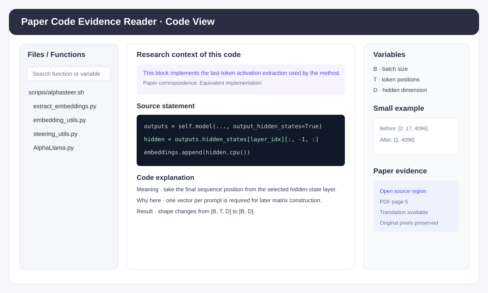
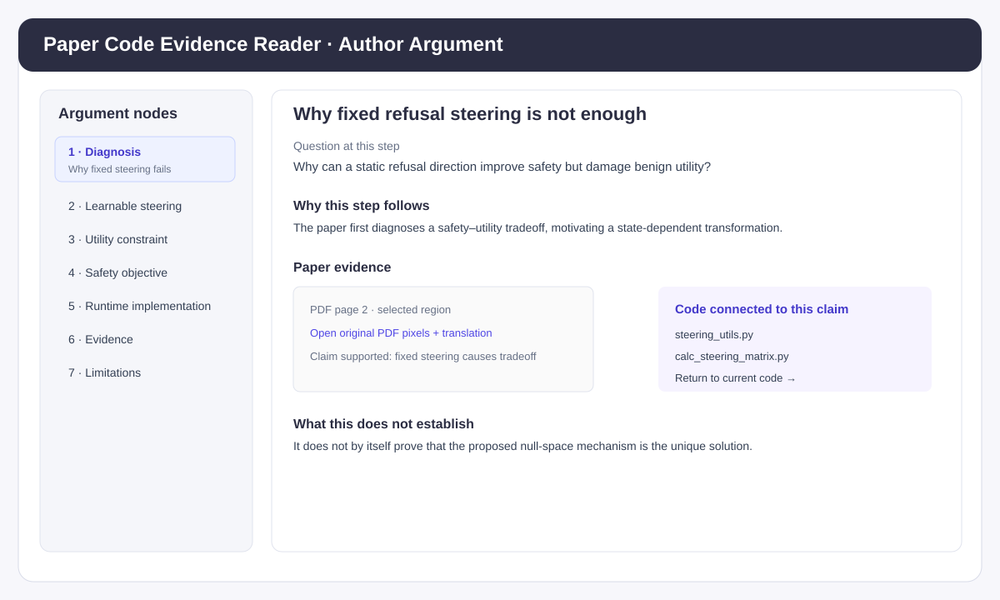
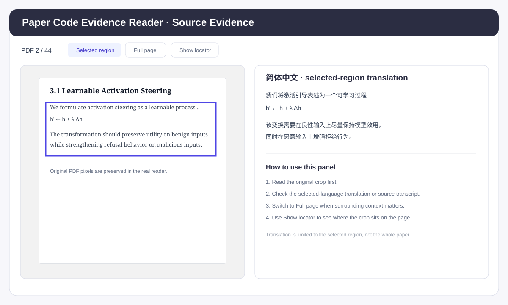

# paper-code-mapper

<p align="center">
  <strong>Paper Code Evidence Reader</strong><br/>
  Code-first research paper × GitHub repository walkthrough with evidence
</p>

`paper-code-mapper` 是一个面向科研论文与对应 GitHub 仓库的 ChatGPT Skill。

它的重点不是“根据论文章节找几段代码”，而是：

> **先沿真实代码执行路径把代码读懂，再恢复论文作者完整的论证主线，并用真实论文证据把两条路线连接起来。**

项目级分析最终可以生成一个**自包含、可离线打开的 HTML Reader**。你不需要启动 Web 服务，也不需要为了阅读 Reader 而运行论文模型。

---

# 1. 你会得到什么

输入：

```text
论文 PDF + 对应 GitHub 仓库
```

经过 Skill 分析后，得到：

```text
                         ┌──────────────────────┐
GitHub repository ──────▶│  Code execution path │
                         └──────────┬───────────┘
                                    │
                                    ▼
                         statement-level reading
                                    │
                                    ▼
                              Code units
                                    │
                                    │  bidirectional links
                                    ▼
Paper PDF ──────────────▶ Author argument ─────▶ Evidence regions
                                    │
                                    ▼
                        Offline interactive HTML
```

HTML Reader 中同时包含：

- 真实源码与文件 / 函数导航
- 逐语句代码解释
- tensor / token / state 变化
- caller / consumer 执行关系
- 作者完整论证主线
- code ↔ argument 双向跳转
- 论文原始 PDF 证据区域
- 中文翻译 / English transcript
- paper-code correspondence status
- 中文 / English 阅读语言切换

---

# 2. 最快使用方式

## Step 1 — 在 ChatGPT 中使用 Skill

准备：

1. 论文 PDF
2. 对应 GitHub 仓库 URL

然后直接给出类似 Prompt：

```text
Use the attached paper and this repository:
https://github.com/AlphaLab-USTC/AlphaSteer

Walk through the official execution path code first.
Explain the actual source statement by statement for a beginner,
trace tensor/state changes and effective configuration values,
then connect each implementation step to the paper's complete argument,
equations, experiments, limitations and original PDF evidence.

Build a Chinese/English offline HTML reader with faithful source translations.
Do not claim the paper experiment was reproduced unless it was actually executed.
```

如果只想看一个函数，也可以直接问：

```text
Focus only on EmbeddingExtractor.extract_embeddings.
Explain exactly which token position is used,
how hidden_states are indexed,
what the tensor shapes are,
and how this corresponds to the paper.
```

> **窄问题**通常直接在聊天中回答。  
> **项目级解析**默认更适合生成 HTML Reader。

## Step 2 — 打开生成的 HTML

分析完成后会得到类似：

```text
paper_code_reader.html
```

直接：

```text
双击 HTML
    ↓
Chrome / Edge / Safari 打开
    ↓
开始阅读
```

无需：

- 启动 Flask / FastAPI
- 安装 Node.js
- 运行论文仓库 launcher
- 下载模型 checkpoint
- 启动 GPU 推理

HTML Reader 是**阅读与证据审计界面**，不是论文模型本身。

---

# 3. HTML Reader 产品说明

下面按实际使用顺序介绍 Reader。

## 3.1 `Read the code` — 从代码执行路径开始



这是最核心的界面。

### 左侧：Files / Functions

左侧不是论文目录，而是**当前分析范围内真实执行路径涉及的源码文件与函数**。

你可以用它：

- 按文件进入源码
- 按函数切换阅读单元
- 搜索函数名
- 搜索变量名
- 顺着推荐 execution route 阅读

例如 AlphaSteer 可能沿着：

```text
scripts/alphasteer.sh
    ↓
extract_embeddings.py
    ↓
embedding_utils.py
    ↓
steering_utils.py
    ↓
calc_steering_matrix.py
    ↓
AlphaLlama.py
    ↓
generate_response.py
```

注意：**文件出现在 Reader 中不代表它一定被 `main()` 调用。** Skill 会区分入口、辅助脚本、独立评估脚本和工程工具。

### 中间：Research context + Source + Explanation

每个代码 block 通常按下面顺序理解：

```text
Research context of this code
          ↓
Exact source statement
          ↓
Meaning
          ↓
Why here
          ↓
Result / state change
          ↓
Next consumer
```

例如：

```python
hidden = outputs.hidden_states[layer_idx][:, -1, :]
```

Reader 不会只写：

```text
“提取 hidden state”
```

而会继续解释：

```text
outputs.hidden_states[layer_idx]
        shape: [B, T, D]

[:, -1, :]
        ↓
对每个 batch 取 sequence 最后一个位置
        ↓
result shape: [B, D]
```

同时说明：

- `:` 是什么
- `-1` 指哪个位置
- 这个位置为什么是当前实现真正使用的位置
- 该向量下一步被谁消费
- 它和论文中的 activation 定义是什么关系

### 右侧：Variables / Small example / Paper evidence

右侧是理解当前代码 block 的辅助区。

常见内容：

**Variables**

```text
B = batch size
T = token / sequence positions
D = hidden dimension
```

**Small example**

```text
Before: [2, 17, 4096]
After:  [2, 4096]
```

**Paper evidence**

用于直接打开与当前代码相关的论文原始证据。

---

# 4. `Author argument` — 不把论文拆成零散注释



代码执行顺序和论文论证顺序不是一回事。

因此 Reader 单独保留 **Author argument** 视图。

典型逻辑：

```text
Problem / Observation
        ↓
Diagnosis / Hypothesis
        ↓
Method Design
        ↓
Experiment / Ablation
        ↓
Supported Conclusion
        ↓
Limitations / Missing Evidence
```

这里重点不是问：

```text
“Section 3.2 对应哪个函数？”
```

而是问：

```text
作者为什么先提出这个问题？
        ↓
为什么这个问题会引出这个设计？
        ↓
这个设计具体由哪些代码实现？
        ↓
哪个实验真正测试了这个 claim？
        ↓
实验结果最多能够支持到什么程度？
```

### 每个 argument node 怎么读

重点关注五个区域：

| 区域 | 作用 |
| --- | --- |
| `Question at this step` | 这一论证节点究竟在回答什么 |
| `Why this step follows` | 为什么上一条论证会引出这里 |
| `Paper evidence` | 原文、公式、图表或实验依据 |
| `What this does not establish` | 当前证据不能证明什么 |
| `Code connected to this claim` | 真正实现 / 配置 / 测量这个 claim 的代码 |

### Code ↔ Argument 是双向的

你可以：

```text
Author argument
      ↓
点击代码链接
      ↓
跳到真实 implementation
```

也可以：

```text
Read the code
      ↓
查看 Research context
      ↓
回到完整 argument node
```

这样不会出现“代码读懂了，但不知道论文为什么这样设计”的问题。

---

# 5. `Source + translation` — 直接核对论文原始证据



Reader 的 paper evidence 不是重新排版的一段文字，而是以**原始 PDF 区域**为证据单位。

典型证据窗口包括：

```text
Original PDF pixels       Translation / transcript
       │                            │
       ├── Selected region          ├── 简体中文
       ├── Full page                └── English transcript
       ├── Show locator
       └── Zoom
```

### `Selected region`

只显示真正支持当前 claim 的论文区域。

适合快速核对：

- 一段方法定义
- 一个公式
- 一段实验结论
- 图表 caption
- limitation

### `Full page`

当你担心“截取上下文不够”时切换到整页。

适合检查：

- 前后限定条件
- 跨段上下文
- 图表附近说明
- 公式定义之前的符号解释

### `Show locator`

在整页中标出 selected region 位于哪里。

特别适合双栏论文。

### Translation

右侧显示的翻译只对应当前 selected region。

```text
Original PDF pixels
        ≠
Translation
        ≠
Author interpretation
        ≠
Code explanation
```

这四层信息必须分开。

Reader 不应该把分析者自己的解释伪装成论文原文翻译。

---

# 6. 两个语言选择器分别控制什么

Reader 顶部通常有：

```text
Reading language
Source / translation language
```

它们是**独立选择器**。

## Reading language

控制整个教学阅读层：

- UI
- code explanation
- Meaning / Why here / Result
- Variables
- Small example
- paper commentary
- Author argument

例如：

```text
English
   ↓
简体中文
```

切换后，不只是按钮变成中文，代码解释本身也会切换。

## Source / translation language

控制论文证据截图旁边的文字：

```text
简体中文
    → faithful region translation

English
    → source-language transcript
```

不会改动：

- 源代码
- 变量名
- 公式
- 数值
- PDF 原图

---

# 7. paper-code correspondence status 怎么读

Skill 不会笼统地说：

```text
“这段代码对应论文 Eq. 7”
```

而是明确标记对应关系。

| Status | 在 Reader 中如何理解 |
| --- | --- |
| `Exact match` | 当前代码与论文描述直接一致 |
| `Equivalent implementation` | 写法 / tensor orientation 不同，但计算含义等价 |
| `Partial match` | 当前代码只实现论文描述的一部分 |
| `Runtime override` | 实际运行值覆盖默认配置或论文常用值 |
| `Implementation extension` | 代码比论文公开描述额外做了一步 |
| `Potential mismatch` | 论文与 released code 存在值得检查的不一致 |
| `No direct paper counterpart` | 工程代码，没有直接 research claim |
| `Unresolved` | 当前证据不足，不强行下结论 |

看到 `Potential mismatch` 或 `Unresolved` 时，建议直接打开 Source Evidence 再核对代码。

---

# 8. 推荐阅读路线

第一次打开一个 Reader，可以按这个顺序：

```text
01  Reading route
      ↓
02  Read the code → 入口文件
      ↓
03  Research context
      ↓
04  顺着 Files / Functions 阅读核心路径
      ↓
05  Variables / Small example
      ↓
06  Author argument
      ↓
07  Argument → Code 双向跳转
      ↓
08  Source + translation 核对论文原文
      ↓
09  检查 Runtime override / Potential mismatch
      ↓
10  Limitations / Missing evidence
```

如果你的目标只是：

> “这篇论文的代码到底怎么跑？”

优先：

```text
Reading route + Read the code
```

如果你的目标是：

> “released code 真的实现了论文说的东西吗？”

优先：

```text
Author argument
+ Source evidence
+ correspondence status
```

---

# 9. 一个完整示例：AlphaSteer

以 AlphaSteer 为例，一个 Reader 可以把两条路线同时保留下来。

### Code execution route

```text
experiment launcher
      ↓
activation extraction
      ↓
last-position hidden states
      ↓
benign null-space projector
      ↓
malicious regression
      ↓
steering matrix
      ↓
Llama runtime intervention
      ↓
generation
```

### Author argument route

```text
fixed refusal steering creates a safety–utility tradeoff
      ↓
steering should depend on model state
      ↓
benign behavior should lie in a protected null space
      ↓
malicious activations should be mapped toward refusal behavior
      ↓
apply the learned transformation at selected layers
      ↓
evaluate safety and utility
      ↓
state tested-scale limitations
```

Reader 会把两条路线连接，而不是用其中一条替代另一条。

---

# 10. 作为 ChatGPT Skill 使用

Skill 核心入口：

```text
SKILL.md
```

UI metadata：

```text
agents/openai.yaml
```

项目目录：

```text
paper-code-mapper/
├── README.md
├── SKILL.md
├── agents/
│   └── openai.yaml
├── scripts/
├── references/
├── assets/
├── docs/
│   └── images/
└── tests/
```

`SKILL.md` 中的 Skill name：

```text
paper-code-mapper
```

显示名称：

```text
Paper Code Evidence Reader
```

---

# 11. 如果你想自己构建 HTML Reader

> 普通使用者不需要执行这一节。  
> 这一节面向要开发 / 修改 Reader 的用户。

分析内容必须先基于真实论文和源码完成。下面的脚本负责**渲染、合并与验证**，不会自动理解论文。

## 11.1 渲染 PDF source regions

```bash
python scripts/render_sources.py \
  --pdf paper.pdf \
  --regions regions.json \
  --output-dir source_images
```

依赖：

```text
PyMuPDF
Pillow
```

## 11.2 合并 source layer 与 translations

```bash
python scripts/merge_sources.py \
  --analysis analysis.json \
  --sources source_images/source_layer.json \
  --translations translations.json \
  --output analysis_bilingual.json
```

## 11.3 构建自包含 HTML

```bash
python scripts/build_reader.py \
  --input analysis_bilingual.json \
  --output reader.html \
  --source-pdf paper.pdf \
  --report validation.json
```

如果有本地源码树，可增加 verbatim source-range 验证：

```bash
python scripts/build_reader.py \
  --input analysis_bilingual.json \
  --repo-root /path/to/repository \
  --source-pdf paper.pdf \
  --output reader.html \
  --report validation.json
```

## 11.4 导出翻译

```bash
python scripts/export_translations.py \
  --input analysis_bilingual.json \
  --language zh-CN \
  --output selected_regions_zh.md
```

---

# 12. Validation

运行测试：

```bash
python -m unittest discover -s tests -v
```

如果环境中有 Chromium / Playwright，可以继续做浏览器检查。

需要注意：

```text
schema validation
    ≠ semantic correctness

source-range validation
    ≠ paper-code equivalence proof

PDF hash match
    ≠ experiment reproduction

browser smoke test
    ≠ scientific result validation
```

---

# 13. 设计边界

本 Skill 默认进行**静态源码分析与证据阅读**。

不会为了生成 Reader 自动：

- 安装未知科研仓库依赖
- 下载大型模型 checkpoint
- 运行 GPU 实验
- 执行未知 launcher
- 声称复现论文实验结果

如果只执行一个 synthetic calculation，也只会声明：

```text
这个小型计算被验证
```

而不会写成：

```text
论文已经被复现
```

---

# 14. 适合什么场景

- 论文 + GitHub 仓库精读
- 论文复现前的代码审计
- LLM / NLP / CV / AI Security 方法理解
- activation / hidden states / token / loss 追踪
- jailbreak / steering / model editing 代码分析
- paper implementation 与 released code 一致性检查
- 给零基础或跨方向研究者制作科研代码阅读材料

---

# 15. 核心原则

```text
Code execution order ≠ Paper argument order

Function definition ≠ Function execution

Call edge ≠ Argument edge

Correct implementation ≠ Reproduced result

Better metric ≠ Proven mechanism
```

这五条原则是 `paper-code-mapper` 与普通“论文代码对应工具”最大的区别。
